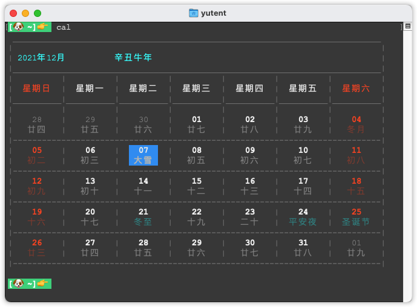

```
  ____      _                _            
 / ___|__ _| | ___ _ __   __| | __ _ _ __ 
| |   / _` | |/ _ \ '_ \ / _` |/ _` | '__|
| |__| (_| | |  __/ | | | (_| | (_| | |   
 \____\__,_|_|\___|_| |_|\__,_|\__,_|_|   终端版万年历
                                                               
```
农历的计算, 只支持 1901-2100 范围内的。





## 安装
```bash
npm i -g bash-calendar
# 安装完之后, 可以使用 calendar命令
# 也可以使用 简写的 cal命令
```

## 用法
> 用法: `cal [command] args...`

- Commands:           
  * -y {year}             -    打印指定年份的日历
  * -m                    -    打印指定月份的日历
  * -h                    -    查看帮助文档
  * -v                    -    查看程序的版本
  * -c                    -    导入自定义休假日, 必须是标准json格式, 语法看下面的示例

示例:     

```bash
cal # 不带参数打印当前年月
cal -y # -y不接参数, 打印当前年的所有月份
cal -y 2000   # 打印指定年份的所有月份
cal -y 2021 5     # 打印指定年份, 指定月份
cal -y 2000 -m 3  # 同上
cal -m 5   # 打印当前年份的 指定月份
cal -c {"2021.12.11":"班","2021.12.12":"休"}   # 导入自定义休假日
```

## 更新日志

### v1.2.0
* 增加导入自定义节假日的功能
* 修复日历中 1月份和12月份中的 上一个月/下一个月的节日显示

### v1.1.0
* 增加二四十节气的显示

### v1.0.2
* 修复当天农历是3个字时的排版异常
* 周末的农历增加暗红色显示

### v1.0.0
* 完成农历显示、公历节日及农历节日的显示

### v0.0.1
* 初始化项目
